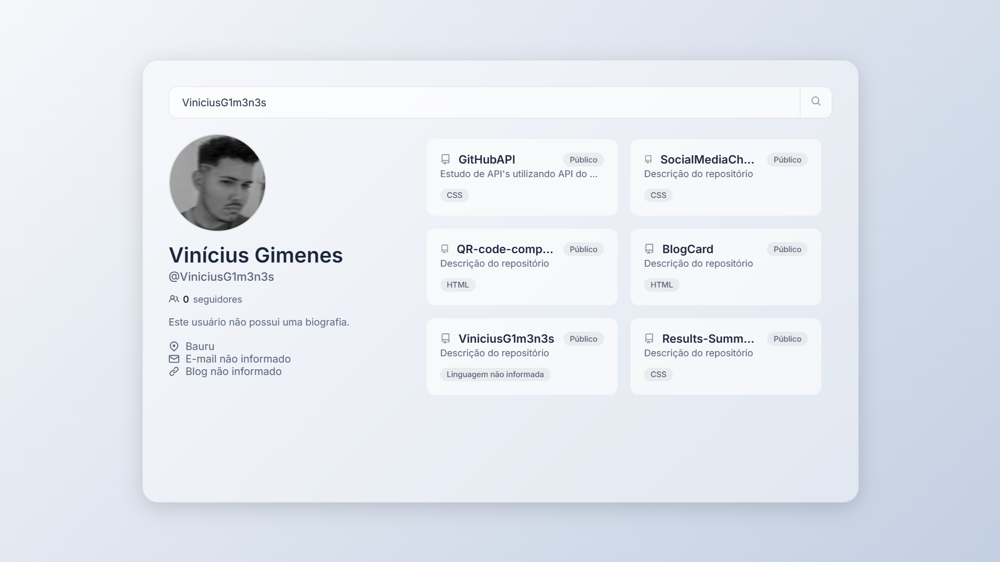

# GitHub Profile Finder



A modern and responsive GitHub profile search application built with vanilla JavaScript, utilizing the GitHub API. This project was inspired by and developed while following the tutorial "Projeto Real com a API GitHub" by Senhor Programador.

## 🚀 Features

- Real-time user search with autocomplete suggestions
- Display user profile information including:
  - Profile picture
  - Name and username
  - Bio
  - Follower count
  - Location
  - Email
  - Blog/Website
- Show latest repositories with:
  - Repository name with link
  - Public/Private status
  - Description
  - Primary language used

## 💻 Technologies Used

- HTML5
- CSS3 (with modern features like CSS Variables and Flexbox)
- Vanilla JavaScript (ES6+)
- GitHub REST API
- Responsive Design with Media Queries

## 🌟 Key Improvements Over Tutorial

- Added autocomplete search functionality
- Implemented debouncing for API calls
- Enhanced UI with glassmorphism effect
- Improved responsive design
- Added loading states
- Better error handling

## 🎨 Design Features

- Modern glassmorphism effect
- Smooth animations and transitions
- Responsive layout for all device sizes
- Elegant scrollbars
- Hover effects on interactive elements

## 🛠️ Installation

1. Clone the repository:
```bash
git clone https://github.com/yourusername/github-profile-finder.git
```

2. Navigate to project directory:
```bash
cd github-profile-finder
```

3. Open `index.html` in your browser or use a local server:
```bash
# Using Python
python -m http.server 8000

# Using Node.js
npx serve
```

## 🔧 Usage

1. Type a GitHub username in the search box
2. Select from autocomplete suggestions or press enter
3. View the user's profile information and repositories

## 📱 Responsive Design

- Desktop (1024px and above)
- Tablet (768px to 1023px)
- Mobile (480px to 767px)
- Small Mobile (320px to 479px)

## 🙏 Credits

- Original tutorial by [Senhor Programador](https://youtu.be/SNFZv2UQwS8?si=l4ihK8fisSslw_TQ)
- GitHub API Documentation
- Inter font by Google Fonts

## 👨‍💻 Author

- GitHub: [@ViniciusG1m3n3s](https://github.com/ViniciusG1m3n3s)
- LinkedIn: [Vinícius Gimenes]([https://linkedin.com/in/yourprofile](http://www.linkedin.com/in/vin%C3%ADcius-gimenes-7bba93199))
